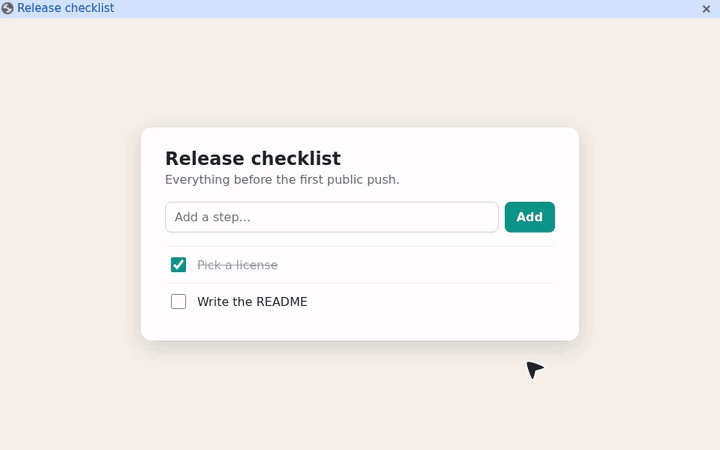
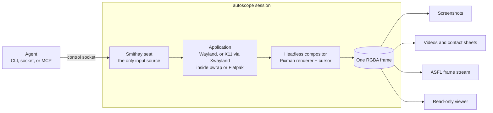

<div align="center">

# autoscope

**Eyes and hands for autonomous agents, inside a private Linux app.**

</div>

autoscope runs one Linux application inside its own headless Wayland compositor and gives an agent a socket to see and drive it: screenshots, mouse, keyboard, drag gestures, videos, and contact sheets. Native Wayland and X11 apps share the same interface, the app runs in a bubblewrap or Flatpak sandbox, and your own mouse and keyboard are never touched.

<p align="center">
  
</p>

- **One contract for every app.** Start a session, read one JSON line, drive the returned control socket.
- **Observe, then act.** Each input waits for the screen to settle and reports the frame it produced. The MCP server rejects actions planned against a stale screenshot.
- **Evidence built in.** PNG screenshots, MP4 recordings, contact sheets for image-only models, and a raw realtime frame stream.
- **Isolated by default.** Private displays, a private home, a read-only project mount, one shared folder, and optional network removal.
- **Agent-ready.** A stdio MCP server, plus a prebuilt Codex plugin that needs no setup step.

## Contents

- [Quick start](#quick-start)
- [Driving it from an agent](#driving-it-from-an-agent)
- [Codex plugin](#codex-plugin)
- [How it works](#how-it-works)
- [Building the portable runtime](#building-the-portable-runtime)
- [Contributing](#contributing)
- [Related projects](#related-projects)
- [License](#license)

## Quick start

You need Linux, a recent stable Rust toolchain, `pkg-config`, and the xkbcommon and pixman development headers (`libxkbcommon-devel pixman-devel` on Fedora, `libxkbcommon-dev libpixman-1-dev` on Debian and Ubuntu).

```bash
git clone https://github.com/mii-nipah/autoscope
cd autoscope
cargo build --release
```

Start an application. `run` prints one JSON line once the session is ready, and `--detach` gives your terminal back:

```bash
./target/release/autoscope run --detach --name hello -- zenity --entry --text "What should the agent say?"
```

```json
{"app_pid":4242,"control":"/run/user/1000/autoscope-hello-XXXX/control.sock","fps":15,"log":"/home/you/.local/state/autoscope/sessions/hello-XXXX/session.log","pid":4240,"session":"/home/you/.local/state/autoscope/sessions/hello-XXXX","shared_dir":"/home/you/.local/state/autoscope/sessions/hello-XXXX/files","size":[1280,800],"status":"ready","stream":"/run/user/1000/autoscope-hello-XXXX/stream.sock"}
```

Drive it through the `control` socket from that line:

```bash
CONTROL=/run/user/1000/autoscope-hello-XXXX/control.sock
./target/release/autoscope ctl "$CONTROL" type "hello from an agent"
./target/release/autoscope ctl "$CONTROL" screenshot hello.png
./target/release/autoscope ctl "$CONTROL" quit
```

Add `--window` to `run` to watch a read-only live view. Flatpak apps only need their ID, for example `run --flatpak com.google.Chrome -- https://example.com`.

Every command and option is documented in the [command guide](USAGE.md), which is also built into the binary as `autoscope readme`.

### Optional host tools

| Tool | Enables |
| --- | --- |
| `bwrap` (bubblewrap) | The filesystem sandbox for host commands, used automatically when installed |
| Xwayland | X11 applications, detected automatically |
| FFmpeg (`ffmpeg`, `ffplay`) | MP4 recording and the `--window` live viewer |
| Flatpak | Launching installed Flatpak applications |

## Driving it from an agent

`autoscope mcp` is a stdio [MCP](https://modelcontextprotocol.io) server for agents that shouldn't manage processes or socket paths themselves:

```json
{"command": "autoscope", "args": ["mcp"]}
```

Its tools spawn host commands or Flatpaks, click, type, scroll, drag, press keys, and record. Every observation returns a screenshot and a `view` number. Every input tool requires the latest `view` and returns the next screenshot, so an action planned against an outdated screen is rejected before any input happens. One MCP process can own several sessions and closes all of them when its input closes.

Agents that prefer plain processes can use the same lifecycle as the quick start: `run`, read the ready line, send `ctl` commands (or write JSON to the socket directly), then `quit`.

## Codex plugin

[`plugin/autoscope`](plugin/autoscope/README.md) packages autoscope for Codex with a prebuilt Linux x86_64 runtime (glibc 2.35 or newer), its libraries, bubblewrap, FFmpeg, the MCP connection, and a skill for visual app workflows. Install it, start a new task, and ask:

> Open my app in Autoscope, test its main workflow, and show me the result.

No compilation, setup command, or manual MCP configuration is needed.

## How it works



Each session is a one-application Wayland compositor built on [Smithay](https://github.com/Smithay/smithay)'s headless Pixman renderer, with an optional rootless Xwayland server. X11 windows become ordinary Smithay windows, so both protocols share one output, one seat, one cursor, and one canonical frame. Screenshots, recordings, the stream, and the viewer all read that frame. Host input devices are never admitted; only control-socket commands reach the seat.

Under bubblewrap the app sees `/usr`, `/etc`, and `/sys` read-only, a private home and `/tmp`, the launch directory read-only at `/work`, its private displays, and the shared folder read/write. Host displays, the session bus, audio, input devices, and desktop portals stay outside. Flatpak apps are reset with `--sandbox`, then granted only their private displays and session directory, the shared folder, GPU rendering, and network access unless `--no-network` is set.

There is intentionally no desktop shell, portal bridge, clipboard bridge, audio bridge, or remote protocol.

| Module | Responsibility |
| --- | --- |
| [`main.rs`](src/main.rs) | CLI and session startup |
| [`state.rs`](src/state.rs), [`handlers.rs`](src/handlers.rs) | Compositor state and Wayland protocol handlers |
| [`render.rs`](src/render.rs), [`cursor.rs`](src/cursor.rs) | Headless output, frame rendering, and the SVG cursor |
| [`x11.rs`](src/x11.rs) | Xwayland integration |
| [`input.rs`](src/input.rs) | Keyboard and pointer injection |
| [`launch.rs`](src/launch.rs) | bwrap and Flatpak sandboxes |
| [`session.rs`](src/session.rs) | Durable session records, detach, and status |
| [`control/`](src/control.rs) | Control socket, input pacing, visual settling, drags, and viewer |
| [`mcp/`](src/mcp.rs) | MCP server and session coordinator |

## Building the portable runtime

Maintainers build the portable runtime on an Ubuntu 22.04 base with Podman, then package it with Python and `appimagetool`:

```bash
scripts/build-bundle.sh
python3 scripts/package-plugin.py
scripts/package-sources.sh
```

`target/plugin/` then holds the Codex plugin archive, a standalone AppImage, their SHA-256 checksums, and a companion source archive with vendored Rust crates and the exact Ubuntu source packages used by the runtime. The AppImage accepts the same CLI commands and `--appimage-extract-and-run` when FUSE is unavailable.

## Contributing

Issues and pull requests are welcome.

- **Bug reports:** include your distribution, whether the app is native Wayland, X11, or Flatpak, the `autoscope run` command, and the session `log` from the ready line. A screenshot from `autoscope ctl … screenshot` helps a lot.
- **Pull requests:** keep each one focused on one change, and describe the behavior it changes. Run `cargo fmt`, `cargo clippy`, and `cargo test` before opening it.
- **Sandbox and packaging changes:** also run the end-to-end workflows against a built package. They need Xwayland, Xmessage, Zenity, and Flatpak Chrome.

  ```bash
  python3 tests/portable_workflow.py /path/to/autoscope --artifacts target/native-evidence
  python3 tests/plugin_workflow.py /path/to/autoscope --artifacts target/plugin-evidence
  ```

Be kind and assume good faith. Harassment and personal attacks aren't welcome in issues, pull requests, or anywhere else in the project.

## Related projects

- [Smithay](https://github.com/Smithay/smithay): the Wayland compositor library autoscope is built on
- [bubblewrap](https://github.com/containers/bubblewrap): the unprivileged sandbox used for host commands
- [Model Context Protocol](https://modelcontextprotocol.io): the protocol behind `autoscope mcp`
- [xdotool](https://github.com/jordansissel/xdotool), [ydotool](https://github.com/ReimuNotMoe/ydotool), and [wtype](https://github.com/atx/wtype): input automation for existing X11 or Wayland desktops

## License

autoscope is released under the [BSD 3-Clause License](LICENSE). The arrow cursor is adapted from [Streamline](https://streamlinehq.com)'s Flex icon set under [CC BY 4.0](https://creativecommons.org/licenses/by/4.0/); see [NOTICE](NOTICE).
